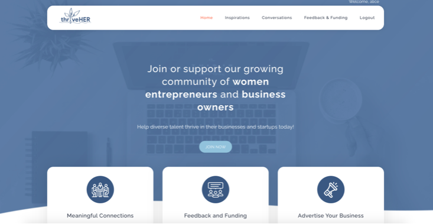
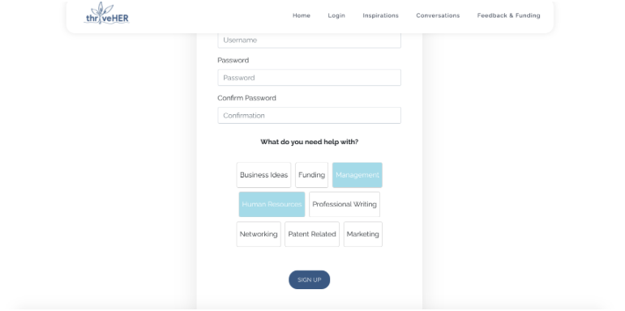
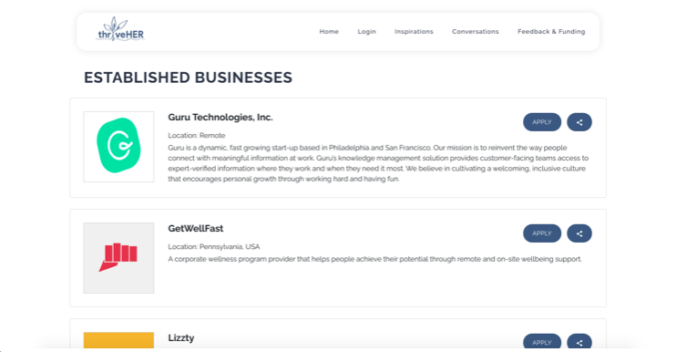
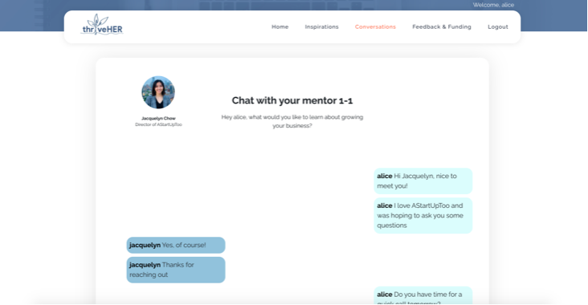
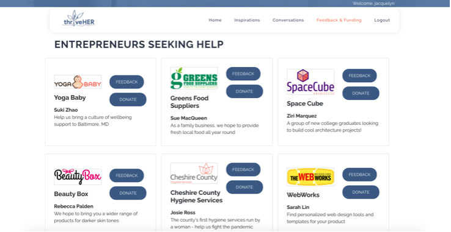
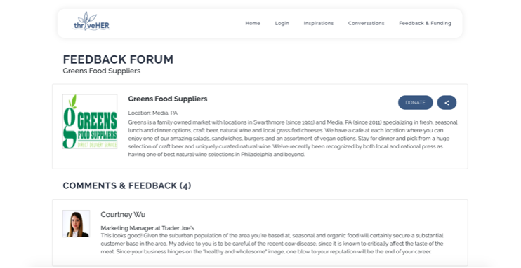

# ThriveHer (Technica 2020)
A platform for womxn entrepreneurs and business owners to pitch their ideas and get guidance from a mentor, and also get funding to get started.

## Contributors
Alice Huang, Jacquelyn Chow, Sojin Lim

## Logo

## Demo Video
[Click here for demo video](https://youtu.be/Y2aJDZ4DTew)

## Inspiration
We decided to build ThriveHer because supporting small businesses and womenx entrepreneurs/business owners is always a pressing issue, but even more so now during the pandemic. We hope this will be a valuable tool for women and non-binary entrepreneurs to form local connections with one another, gain traction in the small business world, and find the key insights they need to make the next leap in their businesses’ journeys. We hope this will empower more women to build successful, influential businesses that will really benefit the whole community!

## What it does
Through ThriveHer, users can gain funding for their entrepreneurial ideas and learn from experienced mentors through 1-1 conversations.

## Tools we used
- Flask app (Python)
- mongoDB for storing user info and mentor-mentee conversations
- HTML/CSS, Bootstrap for frontend
- JavaScript, frontend
- AJAX, JQuery, SocketIO, for instant chat feature

## Challenges we ran into
- Collaborating virtually/in different time zones
- Integrating all the features/db in limited timespan
- Learning/incorporating new technologies

## Accomplishments that we're proud of
- Mentorship w/ established business owners - 1:1 conversations
- Crowdfunding for women entrepreneurs to help build up capital

## What we learned
- Learned how to use and implement a non relational database with mongoDB
- How to build a real-time chat feature using socket.io
- Learned how to use Bootstrap 4

## What's next for ThriveHer
- Discussions page on general business qs, resources listing/shared links
- Allow mentees to choose more than 1 mentor if the community grows
- More incentives for people to mentor

## Website Screenshots 
###### Home Page

###### Tailor your account to your goals for growth

###### Get inspiration from experienced businesses

###### Chat 1-1 with your mentor

###### Crowdfunding so womxn can support one another

###### Feedback to improve your entrepreneurial pitch

